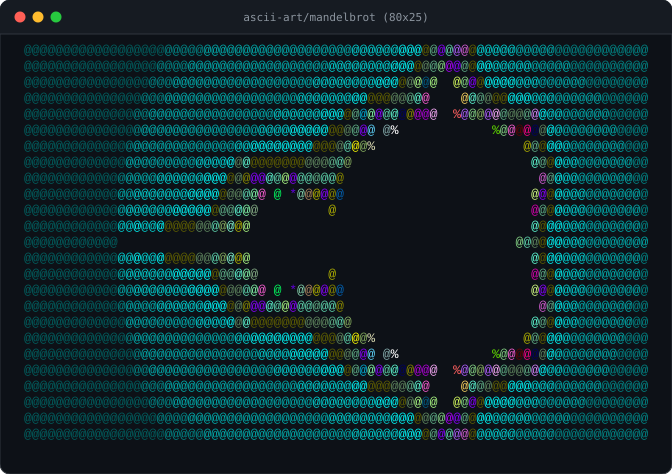

# ASCII Mandelbrot

`mandelbrot.cpp` renders the Mandelbrot set in a terminal using ASCII
characters. The program writes a fixed 80x25 image to standard output.

## Requirements

- A C++17-compatible compiler
- A terminal that displays monospaced text

## Build

Run this command from the repository root:

```sh
g++ -std=c++17 -O2 ascii-art/mandelbrot.cpp -o ascii-art/mandelbrot
```

On Windows with MinGW, the output file will normally be named
`ascii-art/mandelbrot.exe`.

## Run

On Linux or macOS:

```sh
./ascii-art/mandelbrot
```

On Windows PowerShell:

```powershell
.\ascii-art\mandelbrot.exe
```

By default, ANSI 256-color output is enabled. You can pass `--nocolor` to disable colored output:

```sh
./ascii-art/mandelbrot --nocolor
```

The program uses these defaults:

- Width: 80 columns
- Height: 25 rows
- Maximum iterations: 1,000
- Complex-plane bounds: `x = [-2.5, 1.0]`, `y = [-1.0, 1.0]`
- Character gradient: `@%#*+=-:. ` (dense to sparse)

## Example output

Running the program with the defaults produces ANSI 256-color output:



Running with `--nocolor` produces monochrome text:

```text
@@@@@@@@@@@@@@@@@@@@@@@@@@@@@@@@@@@@@@@@@@@@@@@@@@@@@@@@@@@@@@@@@@@@@@@@@@@@@@@@
@@@@@@@@@@@@@@@@@@@@@@@@@@@@@@@@@@@@@@@@@@@@@@@@@@@@@@@@@@@@@@@@@@@@@@@@@@@@@@@@
@@@@@@@@@@@@@@@@@@@@@@@@@@@@@@@@@@@@@@@@@@@@@@@@@@@@@  @@@@@@@@@@@@@@@@@@@@@@@@@
@@@@@@@@@@@@@@@@@@@@@@@@@@@@@@@@@@@@@@@@@@@@@@@@@@@@    @@@@@@@@@@@@@@@@@@@@@@@@
@@@@@@@@@@@@@@@@@@@@@@@@@@@@@@@@@@@@@@@@@@@@@@@@@@@@@  %@@@@@@@@@@@@@@@@@@@@@@@@
@@@@@@@@@@@@@@@@@@@@@@@@@@@@@@@@@@@@@@@@@@@@@ @%            %@@@@@@@@@@@@@@@@@@@
@@@@@@@@@@@@@@@@@@@@@@@@@@@@@@@@@@@@@@@@@@@@%                   @@@@@@@@@@@@@@@@
@@@@@@@@@@@@@@@@@@@@@@@@@@@@@@@@@@@@@@@@@@                       @@@@@@@@@@@@@@@
@@@@@@@@@@@@@@@@@@@@@@@@@@@@@@@@@@@@@@@@@                         @@@@@@@@@@@@@@
@@@@@@@@@@@@@@@@@@@@@@@@@@@@@@@ @ *@@@@@@                        @@@@@@@@@@@@@@@
@@@@@@@@@@@@@@@@@@@@@@@@@@@@@@         @                         @@@@@@@@@@@@@@@
@@@@@@@@@@@@@@@@@@@@@@@@@@@@@                                    @@@@@@@@@@@@@@@
@@@@@@@@@@@@                                                   @@@@@@@@@@@@@@@@@
@@@@@@@@@@@@@@@@@@@@@@@@@@@@@                                    @@@@@@@@@@@@@@@
@@@@@@@@@@@@@@@@@@@@@@@@@@@@@@         @                         @@@@@@@@@@@@@@@
@@@@@@@@@@@@@@@@@@@@@@@@@@@@@@@ @ *@@@@@@                        @@@@@@@@@@@@@@@
@@@@@@@@@@@@@@@@@@@@@@@@@@@@@@@@@@@@@@@@@                         @@@@@@@@@@@@@@
@@@@@@@@@@@@@@@@@@@@@@@@@@@@@@@@@@@@@@@@@@                       @@@@@@@@@@@@@@@
@@@@@@@@@@@@@@@@@@@@@@@@@@@@@@@@@@@@@@@@@@@@%                   @@@@@@@@@@@@@@@@
@@@@@@@@@@@@@@@@@@@@@@@@@@@@@@@@@@@@@@@@@@@@@ @%            %@@@@@@@@@@@@@@@@@@@
@@@@@@@@@@@@@@@@@@@@@@@@@@@@@@@@@@@@@@@@@@@@@@@@@@@@@  %@@@@@@@@@@@@@@@@@@@@@@@@
@@@@@@@@@@@@@@@@@@@@@@@@@@@@@@@@@@@@@@@@@@@@@@@@@@@@    @@@@@@@@@@@@@@@@@@@@@@@@
@@@@@@@@@@@@@@@@@@@@@@@@@@@@@@@@@@@@@@@@@@@@@@@@@@@@@  %@@@@@@@@@@@@@@@@@@@@@@@@
@@@@@@@@@@@@@@@@@@@@@@@@@@@@@@@@@@@@@@@@@@@@@@@@@@@@@@@@@@@@@@@@@@@@@@@@@@@@@@@@
@@@@@@@@@@@@@@@@@@@@@@@@@@@@@@@@@@@@@@@@@@@@@@@@@@@@@@@@@@@@@@@@@@@@@@@@@@@@@@@@
```

## Customization

To change the image, edit the constants near the top of
[`mandelbrot.cpp`](mandelbrot.cpp), then rebuild. The `width`, `height`, and
`max_iter` constants control the output size and detail; the coordinate bounds
control the portion of the complex plane that is rendered; and `gradient`
controls the characters used for pixels that escape.
